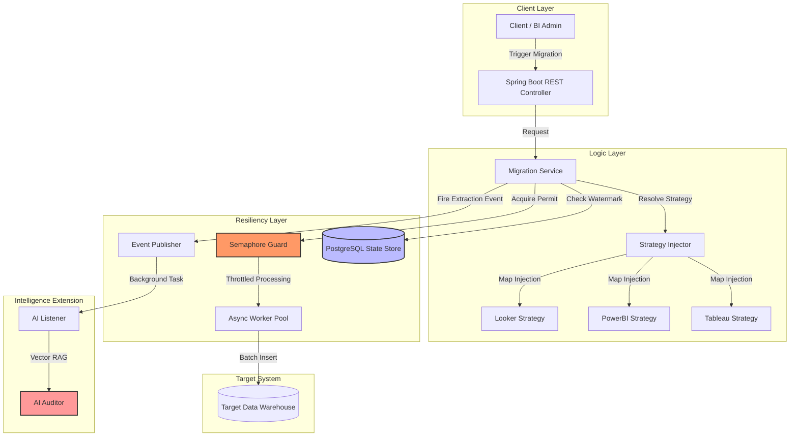
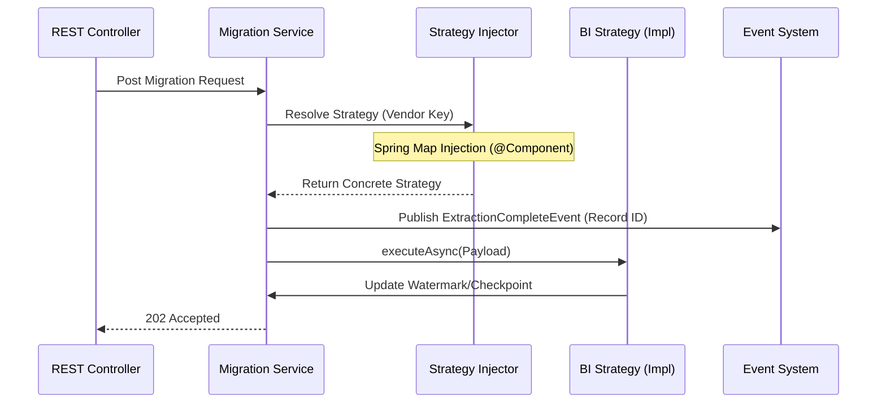

---

# Aura: High-Throughput BI Migration & Rationalization Engine

**Aura** is a resilient, strategy-driven migration framework built with **Spring Boot 3.5** and **Java 21**. It orchestrates complex data transfers between BI vendors (Tableau, PowerBI, Looker) while maintaining high availability and data integrity under massive load.

---

## 🏗️ High-Level Design (HLD)

The architecture demonstrates a decoupled, event-aware flow featuring automated Strategy Resolution, Rate Limiting via Semaphores, and a Resilient State Store.



---

## 🛠️ Low-Level Design (LLD): Strategy Execution Flow

This sequence defines how the **Strategy Injector** dynamically handles vendor-specific logic at runtime, maintaining a clean separation of concerns.



---

## 🚀 Engineering Checklist

### 1. Dynamic Strategy Pattern (LLD)
Aura eliminates brittle `if-else` blocks by using **Spring Map Injection**. The `MigrationServiceImpl` resolves dependencies (Auth, DB, OS, BI-Vendor) at runtime.
* **Impact:** Achieved $O(1)$ extensibility; adding a new BI vendor requires zero changes to core orchestration logic.

### 2. Fault Tolerance & Resiliency (Spring Cloud)
* **Circuit Breaker:** Integrated **Resilience4j** to protect the engine. If the AI service is down or slow, the circuit trips to a fallback, allowing the core migration to proceed without interruption.
* **Atomic Upserts:** Utilizes PostgreSQL native `ON CONFLICT` logic to persist migration state.
* **Fault Tolerance:** Implemented a Checkpointing system allowing the engine to recover from crashes by resuming from the `lastProcessedId`.

### 3. Backpressure & Memory Management
* **Semaphore Guard:** Limits concurrent worker execution to prevent `OutOfMemoryError` on resource-constrained nodes.
* **Resource Scaling:** Effectively caps concurrent "bucket" processing, maintaining stable heap utilization even during peak ingestion of multi-million record batches.
* **Virtual Thread Ready:** Leverages `CompletableFuture` for non-blocking execution, ensuring the engine is future-proofed for Project Loom.
* **Dedicated AI Thread Pool:** Configured a separate `TaskExecutor` for AI tasks to prevent "CPU Starvation," ensuring core migration threads always have priority on edge hardware.

### 4. Event-Driven AI Auditing (Spring AI)
To provide intelligent SQL analysis without blocking the migration pipeline, I implemented an asynchronous auditing layer.
* **Durable Handover:** Extractors persist metadata to the State Store first; events carry only a lightweight ID, minimizing JVM heap pressure.
* **RAG (Retrieval-Augmented Generation):** Utilizes a `VectorStore` to ground AI responses in local technical rules, ensuring the local LLM follows specific vendor migration constraints.

---

## 🛠️ Tech Stack & Optimizations

* **Language:** Java 21
* **Framework:** Spring Boot 3.5 (Web, Data JPA, Cloud, AI)
* **Intelligence:** Spring AI + Ollama (Llama 3.2 1B)
* **Database:** PostgreSQL
* **High-Scale Tuning:**
    * **HikariCP:** Optimized connection pooling for high-concurrency SQL execution.
    * **Hibernate Batching:** Configured `jdbc.batch_size` to minimize database round-trips.
    * **Vector Search:** Semantic rule matching via `EmbeddingModel`.
    * **Testing:** 100% TDD approach using JUnit 5 and Mockito.
---

## 🧠 Design Trade-offs & Decisions

* **Semaphore vs. Message Queue:** Chose Semaphores for in-process backpressure to minimize infrastructure complexity while guaranteeing memory safety.
* **PostgreSQL for State:** Leveraged a relational DB for checkpointing to maintain ACID compliance on migration offsets.
* **Local LLM vs. Cloud API:** Integrated **Ollama** on the edge to ensure metadata never leaves the local environment (Data Privacy) and to avoid API costs during multi-million record audits.

---

## 🚦 Getting Started

### 1. Spin up the Infrastructure

```yaml
# docker-compose.yml
services:
  db:
    image: postgres:latest
    environment:
      POSTGRES_DB: auradb
      POSTGRES_USER: aura_user
      POSTGRES_PASSWORD: aura_password
    ports:
      - "5432:5432"
```
```bash
docker-compose up -d # Spins up PostgreSQL
ollama run llama3.2:1b # Starts local AI engine
```
> "Copy `src/main/resources/application.properties.example` to `application.properties` and update your database credentials before running."

### 2. Build & Run
```bash
mvn clean install
mvn spring-boot:run
```

### 3. Trigger a Migration
```bash
curl -X POST http://localhost:8080/api/v1/migration/run \
-H "Content-Type: application/json" \
-d '{
  "vendor": "tableau",
  "auth": "google",
  "db": "postgresvalidator",
  "os": "win",
  "biValidator": "tableauvalidator",
  "uploader": "file"
}'
```

---

## 🧪 Testing
The project follows **Test-Driven Development (TDD)**. Verify strategy resolution, concurrency guards, and the AI event handshake:

```bash
mvn test
```

---